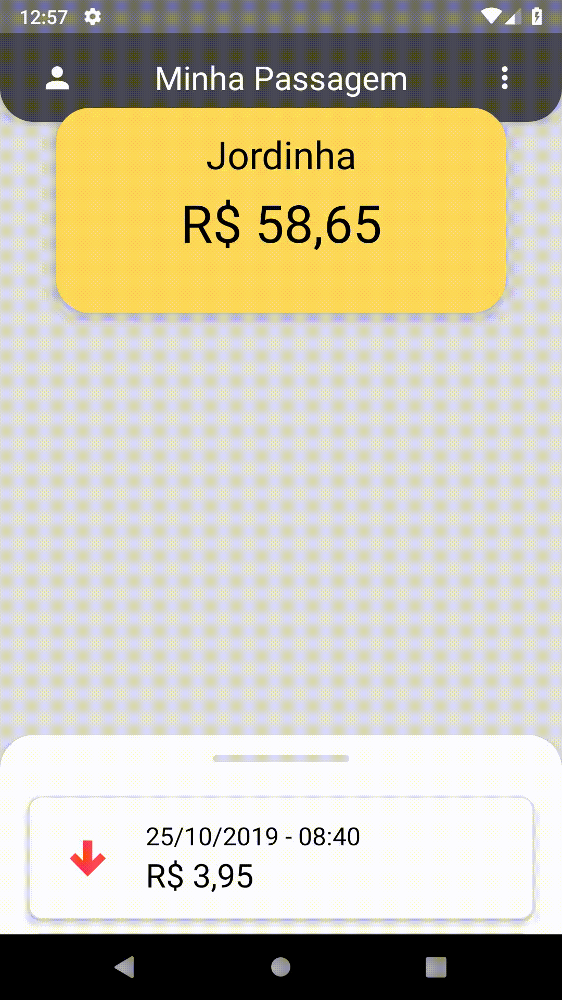

# Draggable view animation

<p align="center">

</p>

## Component transaction
- ### index.js
```javascript
import React, { useState, useEffect, useRef } from 'react';
// import Animated from 'react-native-reanimated';
import { Animated } from 'react-native';
import { PanGestureHandler, State } from 'react-native-gesture-handler';

import { Container, Header, PushBar, TransactionList } from './styles';

import CardTransaction from '~/components/CardTransaction';

const list = ['1', '2', '3', '4', '5', '6', '7'];

export default function Transaction() {
  let offset = 0;
  let opened = false;

  const transactionListRef = useRef();

  const [isOpened, setIsOpned] = useState(false);
  const transactionY = new Animated.Value(0);

  function animatedEvent(event) {
    transactionY.setValue(event.nativeEvent.translationY);
  }

  function onHandlerStateChanged(event) {
    if (event.nativeEvent.oldState === State.ACTIVE) {
      opened = false;
      const { translationY } = event.nativeEvent;

      offset += translationY;

      if (translationY <= -50) {
        opened = true;
      } else {
        transactionY.setOffset(0);
        transactionY.setValue(offset);
        offset = 0;
      }

      Animated.timing(transactionY, {
        toValue: opened ? -300 : 0,
        duration: 500,
        useNativeDriver: true,
      }).start(() => {
        offset = opened ? -300 : 0;
        transactionY.setOffset(offset);
        transactionY.setValue(0);
      });
    }
  }

  return (
    <Container
      style={{
        transform: [
          {
            translateY: transactionY.interpolate({
              inputRange: [-300, 0, 200],
              outputRange: [-300, 0, 50],
              extrapolate: 'clamp',
            }),
          },
        ],
      }}
    >
      <PanGestureHandler
        onGestureEvent={animatedEvent}
        onHandlerStateChange={onHandlerStateChanged}
      >
        <Header>
          <PushBar />
        </Header>
      </PanGestureHandler>
      <TransactionList
        ref={transactionListRef}
        data={list}
        keyExtractor={item => String(item)}
        renderItem={CardTransaction}
      />
    </Container>
  );
}

```


- ### styles.js
```javascript
import styled from 'styled-components';
import { View, FlatList, Animated } from 'react-native';
// import Animated from 'react-native-reanimated';

import { metrics, colors } from '~/styles';

export const Container = styled(Animated.View)`
  position: absolute;
  flex: 1;
  align-items: center;
  width: 100%;
  height: ${300 + 145}px;
  top: ${metrics.screenHeight - 170};
  background-color: white;
  border-top-left-radius: ${metrics.baseRadius * 5};
  border-top-right-radius: ${metrics.baseRadius * 5};
  elevation: 4px;
`;

export const Header = styled(View)`
  width: 100%;
  justify-content: center;
  align-items: center;
  height: 35px;
`;

export const PushBar = styled(View)`
  background-color: ${colors.light};
  border-radius: ${metrics.baseRadius * 3};
  width: 100px;
  height: 5px;
`;

export const TransactionList = styled(Animated.FlatList).attrs({
  showsVerticalScrollIndicator: false,
  contentContainerStyle: { padding: 5 },
})``;
```
